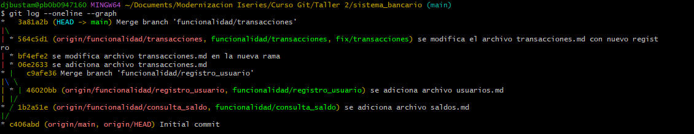

# M1-GIT-S2-JSOSA
# **Taller: Sistema Bancario con Múltiples Funcionalidades**
> **Larry M. Ramírez - Coach Tecnico**

# Objetivo.

Los asistentes configurarán un repositorio remoto en GitHub, aplicando gestión de ramas, creación de merges y realizando la resolución de conflictos.

# CursoGit
curso sofka

# Prueba de actualización desde git hub 

jose mauricio sosa lopez

